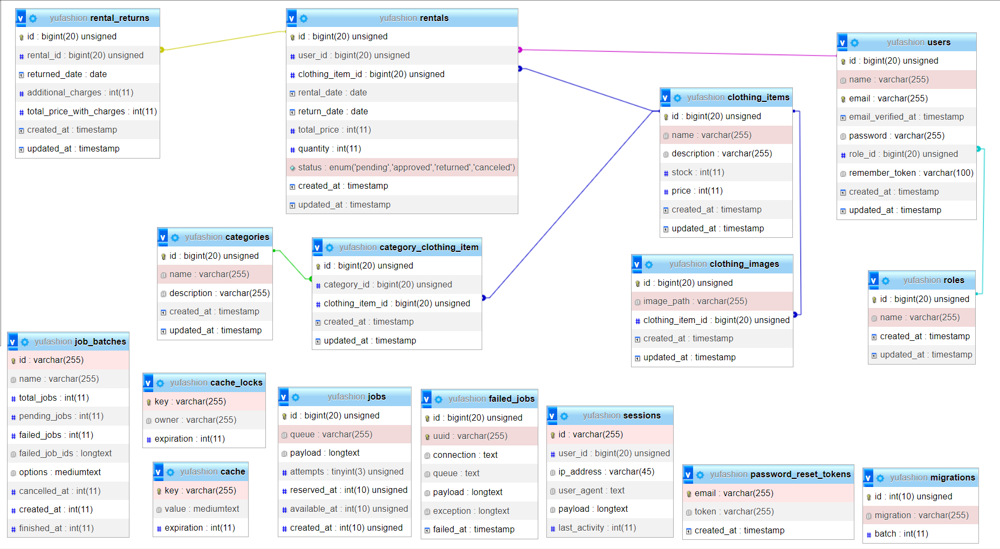

# **Yufashion**

## Anggota Team - Yufashion
1. **Abiyoga Dhaniswara**  
2. **Yuwandi Ruli Bayhaqqi**  

## Deskripsi Proyek
**Yufashion** adalah sebuah aplikasi berbasis web yang memungkinkan pengguna untuk menyewa kostum dengan mudah. Aplikasi ini dirancang untuk memfasilitasi proses peminjaman kostum dengan fitur pencarian, pemilihan kostum berdasarkan ketersediaan, dan manajemen inventaris kostum oleh admin. Proyek ini dibuat sebagai bagian dari tugas akhir.

## List Fitur

1. **Admin**
   - Login
   - Menambah, Mengedit, Menghapus user
   - Menambah, Mengedit, Menghapus pakaian
   - Menambah, Mengedit, Menghapus category pakaian
   - Melihat peminjaman pakaian
   - Approve peminjaman pakaian
   - Konfirmasi pengembalian pakaian
   - Mengelola stok pakaian
   - Mencetak history peminjaman pengguna

2. **User**
   - Login
   - Dashboard utama (melihat ketersediaan kostum, rincian kostum)
   - Mengisi form peminjaman kostum (maksimal 2 kostum, maksimal 5 hari)
   - Melihat riwayat peminjaman
   - Edit profile

## Screen Capture Gambar Schema Project Dari Database

## Screen Recorder Demo - Penjelasan Website
[Screen Recorder Demo Penjelasan Website]
